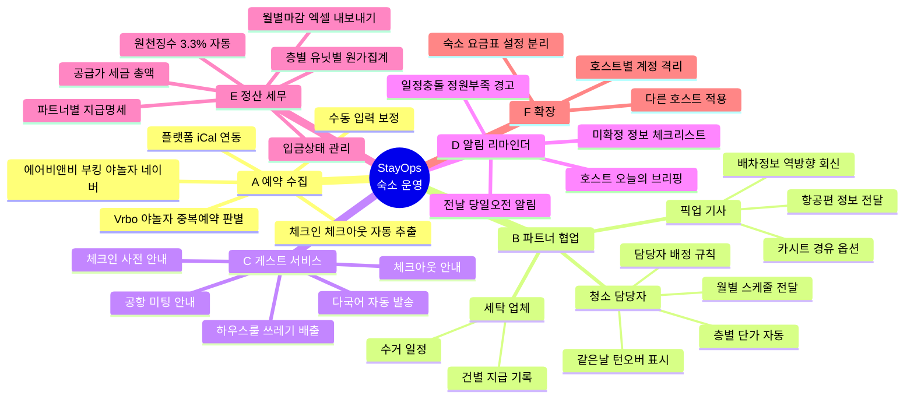
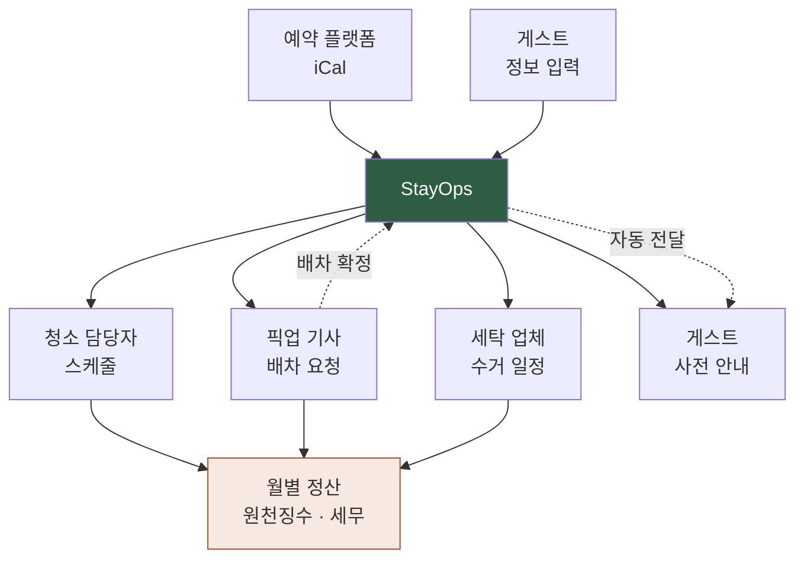

# StayOps — 요구사항 정의서

소규모 숙박업 운영자를 위한 **파트너 협업 · 정산 자동화 플랫폼**

---

## 왜 만드는가

소규모 스테이 호스트는 예약 플랫폼(에어비앤비·부킹닷컴·야놀자·네이버)에서 정보를 받아, **여러 파트너에게 각각 다른 형식으로 다시 전달하는 중계자** 역할을 한다.

```
예약 발생
   ↓
호스트가 읽고 → 청소 담당자에게 스케줄 전달
            → 픽업 기사에게 항공편 정보 전달
            → 세탁 업체에 수거 일정 전달
            → 게스트에게 체크인 안내 전달
   ↓
각 파트너에게서 회신 받아 → 다시 게스트에게 전달
   ↓
월말에 파트너별 정산 · 원천징수 · 세무 자료 정리
```

**한 건의 예약이 최소 4~6번의 수동 중계를 만든다.** 이 앱의 목적은 그 중계를 없애고, 정보가 파트너와 게스트 사이를 호스트를 거치지 않고 스스로 오가게 하는 것이다. 호스트는 승인과 정산만 본다.

### 실측된 문제 (2026년 7~8월, 실운영 데이터)

| 영역 | 규모 | 문제 |
|---|---|---|
| 픽업/드랍 | 19건 · 192만원 | 19건 중 11건에서 정보 누락 → 재문의. 무료 정책 있으나 91.7%가 호스트 부담 |
| 청소 | 월 최대 35건 | 층별 단가 상이(4~5.5만원), 담당자 3인, 3.3% 원천징수, 같은날 턴오버 21건 |
| 세탁 | 월 9건 | 체크아웃일 기준 지급 기록, 신고 대상 구분 필요 |
| 공통 | — | 일정 충돌을 수기로는 발견 못함 (예: 7/30 10분 차 픽업 2건 12명) |

---

## 전체 구조



---

## 핵심 흐름



---

## A · 예약 수집

모든 업무의 출발점. 여기가 정확해야 청소·픽업·안내가 다 맞는다.

- 플랫폼 iCal 연동 — 에어비앤비, 부킹닷컴, 야놀자, 네이버, Vrbo
- **Vrbo 중복 블록 판별** — Vrbo 캘린더에서 "airbnb" 라벨은 실제로는 야놀자 예약을 에어비앤비에 수동 블록한 것. 자동 판별 규칙 필요
- 부킹닷컴·야놀자 iCal은 자동 fetch 시 400 에러 → 수동 다운로드 업로드 경로 제공
- 체크인·체크아웃 날짜 자동 추출 → 청소 일정 자동 생성
- 누락 예약 수동 입력 보정

---

## B · 파트너 협업

### B-1 · 청소 담당자

가장 복잡하고 건수가 많은 영역 (월 최대 35건).

**요구사항**

- 체크아웃 발생 → 청소 일정 자동 생성
- **층별 단가 자동 적용** — 1F/2F 40,000 · 3F/6F 50,000 · 5F 55,000
- **담당자 배정 규칙** — 기본값: 에어비앤비→유급 담당자 / 부킹닷컴·야놀자→가족 (세무 관리 목적). 규칙은 설정에서 변경 가능
- **같은날 턴오버 강조** — 체크아웃 당일 체크인 (월 21건까지 발생)
- 담당자별 화면 분리 — 본인 담당분만 컬러, 나머지는 회색
- 월별 스케줄 전달 (이미지 + 텍스트)
- 담당자와의 소통 언어 설정 (예: 영어)

### B-2 · 픽업 기사

- 게스트 입력 → 기사 양식 자동 변환 → 전달
- 배차 확정(차량번호·연락처) 역방향 회신 → 게스트에게 자동 안내
- 옵션: 카시트(1만원/개), 터미널 경유 T1↔T2(2만원)
- 항공편 지연 시 수정 → 양쪽 재전송
- 정원·수하물 경고 (7명+캐리어 6개 등)

### B-3 · 세탁 업체

- 체크아웃 기준 수거 일정 생성
- 건별 지급 기록 (체크아웃일 = 지급일 기준)
- 신고 대상 여부 구분

---

## C · 게스트 서비스

호스트가 매번 타이핑하지 않아도 되게, 시점별 안내를 자동 발송.

| 시점 | 내용 |
|---|---|
| 예약 확정 후 | 픽업 필요 여부 문의 (정보 입력 링크) |
| 도착 1~2일 전 | 배차 정보 · 공항 미팅 방법 · 터미널 경유 주의 |
| 체크인 당일 | 출입 방법 · 와이파이 · 하우스룰 |
| 체크아웃 전날 | 쓰레기 배출 방법 · 체크아웃 절차 · 짐보관 안내 |
| 체크아웃 후 | 후기 요청 |

**요구사항**

- 다국어 자동 — 영어 기본, 한국어·중국어. 실제 게스트는 네덜란드·이탈리아·터키어권까지 다양
- 템플릿 편집 가능 (하드코딩 금지)
- 무료 서비스 조건(7박 이상 편도 1회) 자동 판정 후 안내 문구 분기

---

## D · 알림 · 리마인더

**호스트용**

- 오늘의 브리핑 — 오늘/내일 픽업·체크인·체크아웃 건수
- 전날 20시 / 당일 오전 8시 알림
- **경고**
  - 같은 시간대 픽업 중복 (예: 17:30 + 17:40 = 12명)
  - 차량 정원 초과 우려
  - 카시트 미확보
  - 같은날 턴오버 청소 누락
- **미확정 체크리스트** — 도착시간·층·지불방식 누락 건 자동 표시

**파트너용**

- 청소 담당자 전날 알림
- 기사 전날 알림

**전달 경로**

- 1단계: 브라우저 알림 + 구글 캘린더 등록 (폰 알림 확보)
- 2단계: 카카오 알림톡 자동 발송

---

## E · 정산 · 세무

매달 마감과 세무 자료 준비가 한 번에 끝나야 한다.

**금액 구조**

| 필드 | 계산 |
|---|---|
| 공급가 | 요금표·단가 기준 |
| 세금 | 공급가 × 10% |
| 총액 | 공급가 + 세금 |
| 게스트 지불 | 현장 직접 지불액 |
| 호스트 부담 | 총액 − 게스트 지불 |

**파트너별 정산**

- 청소: 건수 × 층별 단가 → **3.3% 원천징수 자동 계산** → 실지급액
- 픽업: 건별 요금 + 옵션 → 지불 분담 → 호스트 지급액
- 세탁: 건별 정액

**관리 기능**

- 입금상태 3단계 — 입금완료 / 입금예정 / 미입금
- 월별 마감: 파트너별 이번 달 지급 총액
- **층별·유닛별 원가 집계** — 어느 객실이 운영비를 얼마나 쓰는지
- 엑셀(TSV) 내보내기 — 세무 신고용, 복사해서 바로 붙여넣기
- 지급명세서 자동 생성 (한글·영문)

---

## F · 확장

같은 문제를 겪는 소규모 호스트가 많다. 처음부터 분리 가능한 구조로 만든다.

- 숙소 목록·단가·요금표·브랜드명을 **설정 데이터로 분리** (하드코딩 금지)
- 호스트별 계정, 데이터 격리
- 파트너 유형 추가 가능 (청소·픽업·세탁 외 시설관리 등)
- 링크 브랜딩: `/book?brand=...`

---

## 개발 우선순위

| 단계 | 범위 | 해결하는 문제 |
|---|---|---|
| **P1** | 게스트 입력 폼 + 파트너 메시지 자동 생성 + 원클릭 전달 | 타이핑 중계 제거 |
| **P2** | DB + 호스트 대시보드 + 캘린더 + 충돌 경고 | 일정 파악·누락 방지 |
| **P3** | 정산·세무 모드 (원천징수·월별 마감·엑셀) | 매달 마감 자동화 |
| **P4** | iCal 자동 연동 + 청소 스케줄 자동 생성 | 예약→업무 자동 전개 |
| **P5** | 알림톡 자동 발송 + 리마인더 | 완전 자동화 |
| **P6** | 멀티 호스트 · SaaS화 | 확장 |

> 현재 P1은 게스트 픽업 폼(`pickup.html`)과 알림 프로토타입(`alerts.html`)으로 부분 구현됨.
> 정산은 엑셀 장부로 운영 중 → P3에서 앱으로 이관.

---

## 기술 스택

현재 운영 환경(후이즈 PHP+MySQL) 기준 선택지:

- **A안 — 기존 환경**: PHP + MySQL. 추가 비용 없음, 기존 도구와 통합 용이. P1~P3 적합
- **B안 — 정적 + 외부 DB**: GitHub Pages + Supabase. 무료 호스팅, 확장 유리
- **C안 — Next.js + Vercel**: SaaS화 고려 시 적합

**권장**: P1~P3은 A안으로 빠르게 실사용 → P4 이후 확장 시점에 C안 검토.

> 주의: GitHub Pages는 정적 호스팅이라 DB가 없다. P2부터는 외부 DB(Supabase 등) 또는 기존 PHP 서버가 반드시 필요하다.
